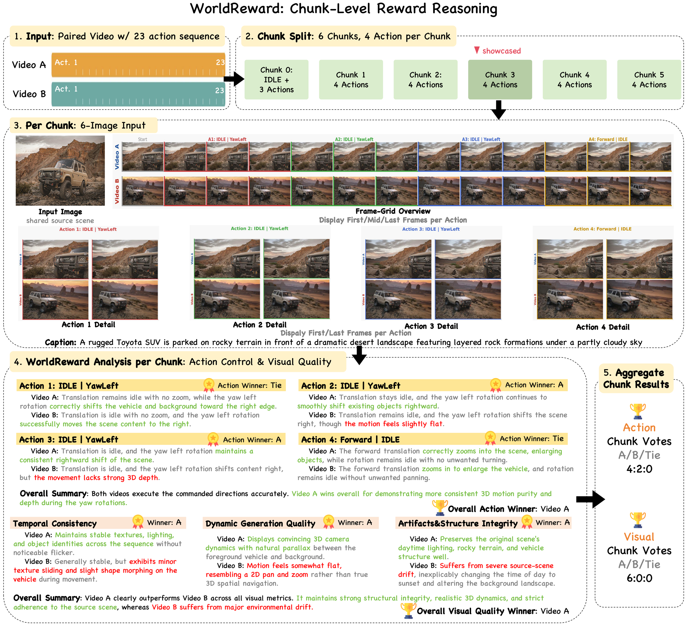
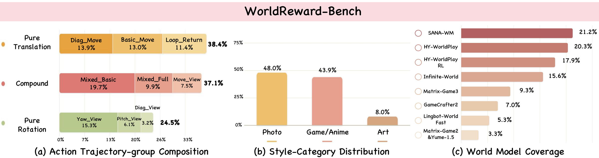

<div align="center">

# WorldReward: Reward Modeling for Camera-Conditioned World Models

<a href="https://github.com/CodeGoat24/WorldReward"></a>
<a href="https://huggingface.co/CodeGoat24/WorldReward-9B"></a>
<a href="https://huggingface.co/datasets/CodeGoat24/WorldReward-Bench"></a>
<a href="LICENSE"></a>

</div>

We release:

1. **[WorldReward](https://huggingface.co/CodeGoat24/WorldReward-9B)** — a reward
   model for camera-conditioned world models. Given a source image, a commanded
   camera trajectory and two generated videos, it judges **action following**
   (per-action camera-motion correctness) and **visual quality** across three
   sub-dimensions: `temporal_consistency`, `dynamic_generation_quality` and
   `artifacts_and_structure_integrity`.

2. **[WorldReward-Bench](https://huggingface.co/datasets/CodeGoat24/WorldReward-Bench)** —
   760 video pairs from 9 world models, each pair generated from the same source
   image and the same camera trajectory, with human verdicts on all three axes.

<div align="center">


</div>

## ⚙️ Install

```bash
git clone https://github.com/CodeGoat24/WorldReward.git
cd WorldReward && pip install -e .
```

Preprocessing and scoring need no GPU. **Inference needs vLLM**, installed
separately because the wheel depends on your CUDA version:

```bash
pip install vllm --extra-index-url https://download.pytorch.org/whl/cu128
```

# 🚀 Part 1 · Running WorldReward

## Score one pair

```bash
python scripts/score_pair.py \
    --input-image  my_data/scene.jpg \
    --left-video   my_data/model_x.mp4 \
    --right-video  my_data/model_y.mp4 \
    --caption      "A sunlit street lined with colorful European-style buildings." \
    --actions      forward,forward,left+camera_down \
    --frames-per-action 8 \
    --show-reasoning
```

```
==============================================================
Verdict  (2 chunks, 2 parsed)
==============================================================
  action      model_x       (A=2 B=0 Tie=0)
  appearance  model_y       (A=1 B=3 Tie=0)
  motion      model_y       (A=0 B=2 Tie=0)
```

`--show-reasoning` additionally prints the model's per-chunk analyses.

## Score many pairs

`score_pair.py` reloads the model each run; use the batch path below for more
than a few pairs.

**1. Describe your pairs** — one JSON object per line:

```json
{"pair_id": "my_pair_0001",
 "input_image": "my_data/my_pair_0001/source.jpg",
 "input_caption": "A sunlit street lined with colorful European-style buildings.",
 "actions": ["forward", "forward", "left+camera_down"],
 "frames_per_action": 8,
 "left":  {"video": "my_data/my_pair_0001/candidate_a.mp4", "model": "model_x"},
 "right": {"video": "my_data/my_pair_0001/candidate_b.mp4", "model": "model_y"}}
```

**2. Render.** WorldReward reads images, not video: every 4 action slots become one
*chunk* of 6 images — source reference, temporal grid, 4 per-action close-ups.

```bash
python scripts/preprocess.py --pairs my_pairs.jsonl \
    --output-root outputs/rendered_chunks --workers 8
```

**3. Score.**

```bash
python scripts/run_inference.py --render-root outputs/rendered_chunks \
    --output outputs/chunk_predictions.json --model CodeGoat24/WorldReward-9B
```

Writes per-chunk reviews to `chunk_predictions.json` and pair verdicts to
`chunk_predictions.pairs.jsonl`. Both stages resume: re-running skips finished work
and retries only chunks whose generation failed to parse.

<details>
<summary><b>📋 Input format reference</b></summary>

#### Required fields

| Field | Type | Meaning |
|---|---|---|
| `pair_id` | string | Unique id. Becomes a directory name, so keep it filesystem-safe. |
| `input_image` | path | The shared source image both videos were generated from. |
| `input_caption` | string | A short English description of the source scene. Shown to the model as scene context. |
| `actions` | list[string] | The commanded camera-action sequence, one token per action step. |
| `left` / `right` | object | The two videos being compared. Each needs a `video` path; `model` is optional metadata. |

Paths may be absolute, or relative to `--base-dir` (which defaults to the
directory containing the JSONL file).

`left` and `right` are the positions the model literally sees. The model has a
mild residual preference for the `left` position, so when comparing two systems,
balance which side each system appears on (or score each pair twice with sides
exchanged).

#### Frame spans

Rendering needs to know which frames belong to which action. Specify **one** of
the following, either inside `left`/`right` (per side) or at the top level
(shared by both):

| Field | Type | Meaning |
|---|---|---|
| `frames_per_action` | int | Every action occupies this many frames. The usual case. |
| `num_frames` | int | Total frame count; split evenly as `num_frames // len(actions)`. |
| `segment_frames` | list[int] | Explicit per-action frame count. Use when actions have unequal duration. |

A per-side value overrides the top-level one, so two videos with different frame
rates can still be compared.

#### Action tokens

A token is a `+`-joined combination of at most one translation and one rotation.
Case-insensitive; unknown tokens fall back to a title-cased rendering.

**Translation:** `forward`, `backward`, `left`, `right`, `forward_left`,
`forward_right`, `backward_left`, `backward_right`

**Rotation:** `camera_up` (pitch up), `camera_down` (pitch down),
`camera_left` (yaw left), `camera_right` (yaw right). Abbreviations `camera_u/d/l/r`,
`yaw_left`, `yaw_right`, `turn_left`, `turn_right` also work. Diagonals
`camera_ul`, `camera_ur`, `camera_dl`, `camera_dr` expand to a yaw+pitch pair.

**No motion:** `idle`, or omit the axis entirely.

Examples: `forward` → `Forward | IDLE`; `left+camera_down` → `Left | PitchDown`;
`camera_dl` → `IDLE | YawLeft+PitchDown`.

#### Chunking

Actions are grouped into chunks of 4 slots, each scored independently. A
synthetic `IDLE` slot is prepended and a short final chunk is padded with the
last frame, so `ceil((len(actions) + 1) / 4)` chunks are produced. Any `actions`
length works.

</details>

<details>
<summary><b>🔧 Python API · serving</b></summary>

#### Using it from Python

```python
from worldreward import render_pair, predict_pair
from worldreward.infer import OfflineRunner

chunks = render_pair(pair, output_root="outputs/rendered_chunks")
runner = OfflineRunner(model_path="CodeGoat24/WorldReward-9B")
records = runner.run(chunks)

verdict = predict_pair(r["review_payload"] for r in records)
# {'action': 'left', 'appearance': 'right', 'motion': 'right'}
```

#### Serving the model

For a single node, the default offline backend is fastest — it skips HTTP and
image transport entirely. Run one process per GPU with `CUDA_VISIBLE_DEVICES`.
When the model is shared across machines, serve it instead:

```bash
bash scripts/launch_vllm_server.sh --model-path CodeGoat24/WorldReward-9B
python scripts/run_inference.py --backend server \
    --render-root outputs/rendered_chunks \
    --output outputs/chunk_predictions.json
```

</details>

# 📈 Part 2 · WorldReward-Bench

760 video pairs from 9 world models, human-annotated on all three axes.

### Download

```bash
python scripts/download_bench.py --output-dir data/WorldReward-Bench
```

Resumable. `--videos-only` skips the overlay videos;
`--metadata-only` fetches just `bench.jsonl`.

```
bench.jsonl                        760 pairs, one JSON object per line
videos/<pair_id>/source.*          shared source image
videos/<pair_id>/left.mp4          video shown on the left
videos/<pair_id>/right.mp4         video shown on the right
videos/<pair_id>/*_overlay.mp4     same videos, commanded action burned in
```

`bench.jsonl` uses the same schema `scripts/preprocess.py` accepts, plus a `label`
field with the human verdicts and the `trajectory_group` / `style` slice keys.

### Reproduce the evaluation

```bash
python worldreward-bench/run_bench.py --model CodeGoat24/WorldReward-9B
```

Downloads if missing, renders, infers, scores. Stages resumable via `--stage`.
Multi-GPU:

```bash
for gpu in 0 1 2 3 4 5 6 7; do
  CUDA_VISIBLE_DEVICES=$gpu python worldreward-bench/run_bench.py \
      --stage preprocess --stage infer --shard $gpu --num-shards 8 &
done
wait
python worldreward-bench/run_bench.py --stage score
```

### Score your own predictor

```bash
# my_predictions.pairs.jsonl, one object per line:
# {"pair_id": "wrb_0001", "action": "left", "appearance": "tie", "motion": "right"}
python worldreward-bench/score.py \
    --bench data/WorldReward-Bench/bench.jsonl \
    --predictions my_predictions.pairs.jsonl
```

Set an axis to `null` (or omit it) if your predictor does not model it — reported
as `--`, not scored as zero.

### Run the baselines

[`baselines/`](baselines) reproduces the comparison. Each script
writes a `*.pairs.jsonl` that `score.py` reads, so baselines and WorldReward go
through the same scoring path. Install each model yourself; only the adapters
live here.

| Baseline | Script | Axes | Needs |
|---|---|---|---|
| Aesthetic | `run_quality_scorer.py --scorer aesthetic` | appearance | CLIP ViT-L/14 + [LAION aesthetic head](https://github.com/christophschuhmann/improved-aesthetic-predictor) |
| HPSv3 | `run_quality_scorer.py --scorer hpsv3` | appearance | [`hpsv3`](https://github.com/MizzenAI/HPSv3) |
| VideoAlign | `run_quality_scorer.py --scorer videoalign` | appearance, motion | [VideoAlign](https://github.com/KwaiVGI/VideoAlign) + `KwaiVGI/VideoReward` |
| UnifiedReward-Think | `run_unified_reward.py --variant think` | appearance, motion | vLLM server |
| UnifiedReward-Flex | `run_unified_reward.py --variant flex` | appearance, motion | vLLM server |
| DAv3 | `run_geometry.py` | action | [Depth-Anything-3](https://github.com/ByteDance-Seed/Depth-Anything-3) |

[`scripts/run_baseline.sh`](scripts/run_baseline.sh) runs one baseline end to end
— shard over GPUs, merge, score:

```bash
bash scripts/run_baseline.sh --baseline hpsv3
bash scripts/run_baseline.sh --baseline dav3 --num-gpus 8
bash scripts/run_baseline.sh --baseline all          # all six, in sequence
```

It writes `<out-dir>/<baseline>.pairs.jsonl` alongside a markdown report and a
metrics JSON. Checkpoint locations are passed through to the adapter, e.g.
`--hpsv3-checkpoint`, `--videoalign-src`, `--depth-anything-3-src`; run with
`--help` for the full list.

The UnifiedReward variants are HTTP clients, so serve the checkpoint first:

```bash
vllm serve CodeGoat24/UnifiedReward-Think-qwen35-9b \
    --served-model-name UnifiedReward --port 8080 \
    --limit-mm-per-prompt '{"image": 16}' --max-model-len 32768

bash scripts/run_baseline.sh --baseline think --url http://127.0.0.1:8080
```

To call an adapter directly instead:

```bash
python baselines/run_quality_scorer.py --scorer hpsv3 \
    --bench data/WorldReward-Bench/bench.jsonl \
    --output outputs/baselines/hpsv3.pairs.jsonl

python worldreward-bench/score.py \
    --bench data/WorldReward-Bench/bench.jsonl \
    --predictions outputs/baselines/hpsv3.pairs.jsonl
```

## 📊 Results

Three-way agreement with human labels (%), all 760 pairs. **Best** / _second_ per
column; `--` = axis not modelled.

| Reward model | All Act. | All App. | All Mot. | Trans Act. | Trans App. | Trans Mot. | Rot Act. | Rot App. | Rot Mot. | Comp Act. | Comp App. | Comp Mot. | Photo Act. | Photo App. | Photo Mot. | Game Act. | Game App. | Game Mot. | Art Act. | Art App. | Art Mot. |
|:---|---:|---:|---:|---:|---:|---:|---:|---:|---:|---:|---:|---:|---:|---:|---:|---:|---:|---:|---:|---:|---:|
| *Closed-source VLM* | | | | | | | | | | | | | | | | | | | | | |
| Gemini-3.1-Pro | 65.79 | _80.13_ | 60.79 | 64.73 | **82.19** | 64.38 | 62.90 | 83.87 | 57.53 | 68.79 | _75.53_ | 59.22 | 65.48 | **82.74** | 63.84 | 65.27 | 79.34 | 57.49 | 70.49 | 68.85 | 60.66 |
| GPT-5.5 | _74.21_ | 79.87 | _69.47_ | _72.95_ | _81.16_ | _74.66_ | _72.04_ | _84.41_ | 62.90 | _76.95_ | _75.53_ | _68.44_ | _76.44_ | _81.64_ | _68.77_ | 71.56 | _79.64_ | _68.86_ | **75.41** | _70.49_ | **77.05** |
| *Image / video quality reward models* | | | | | | | | | | | | | | | | | | | | | |
| VideoAlign | -- | 61.32 | 40.13 | -- | 66.44 | 31.51 | -- | 60.22 | 45.16 | -- | 56.74 | 45.74 | -- | 61.10 | 41.10 | -- | 61.08 | 41.32 | -- | 63.93 | 27.87 |
| UnifiedReward-Flex | -- | 64.34 | 49.32 | -- | 63.18 | 47.65 | -- | 72.63 | 55.31 | -- | 60.14 | 47.10 | -- | 65.08 | 55.03 | -- | 63.32 | 46.08 | -- | 65.45 | 30.91 |
| UnifiedReward-Think | -- | 66.09 | 38.79 | -- | 65.41 | 32.88 | -- | 69.73 | 52.43 | -- | 64.41 | 35.94 | -- | 69.51 | 41.21 | -- | 64.37 | 37.43 | -- | 55.00 | 31.67 |
| Aesthetic | -- | 69.87 | -- | -- | 66.10 | -- | -- | 72.04 | -- | -- | 72.34 | -- | -- | 66.58 | -- | -- | 75.15 | -- | -- | 60.66 | -- |
| HPSv3 | -- | 73.68 | -- | -- | 74.66 | -- | -- | 76.34 | -- | -- | 70.92 | -- | -- | 73.15 | -- | -- | 75.45 | -- | -- | 67.21 | -- |
| *Geometry estimation models* | | | | | | | | | | | | | | | | | | | | | |
| DAv3 | 70.53 | -- | -- | 67.47 | -- | -- | 68.82 | -- | -- | 74.82 | -- | -- | 70.96 | -- | -- | _75.75_ | -- | -- | 39.34 | -- | -- |
| WorldMirror | 68.55 | -- | -- | 67.81 | -- | -- | 68.28 | -- | -- | 69.50 | -- | -- | 67.40 | -- | -- | 74.25 | -- | -- | 44.26 | -- | -- |
| *Backbone, zero-shot* | | | | | | | | | | | | | | | | | | | | | |
| Qwen3.5-9B | 48.42 | 48.29 | 43.82 | 48.29 | 45.55 | 41.78 | 52.69 | 52.15 | 49.46 | 45.74 | 48.58 | 42.20 | 50.14 | 43.84 | 47.12 | 47.01 | 52.10 | 42.81 | 45.90 | 54.10 | 29.51 |
| Qwen3.5-27B | 63.68 | 44.34 | 62.76 | 65.07 | 37.33 | 65.75 | 65.05 | 51.61 | _63.44_ | 61.35 | 46.81 | 59.22 | 64.93 | 38.36 | 66.85 | 62.87 | 51.50 | 58.68 | 60.66 | 40.98 | 60.66 |
| **WorldReward-9B** | **77.63** | **81.32** | **73.03** | **76.71** | 77.74 | **78.77** | **73.12** | **86.02** | **64.52** | **81.56** | **81.91** | **72.70** | **77.26** | 81.37 | **71.78** | **78.74** | **82.04** | **75.75** | _73.77_ | **77.05** | _65.57_ |

## 📧 Contact

If you have any comments or questions, please open a new issue or feel free to contact [Yibin Wang](https://codegoat24.github.io).

## ⭐ Citation

```bibtex
@article{worldreward2026,
  title   = {WorldReward: Reward Modeling for Camera-Conditioned World Models},
  year    = {2026},
  url     = {https://github.com/CodeGoat24/WorldReward}
}
```
